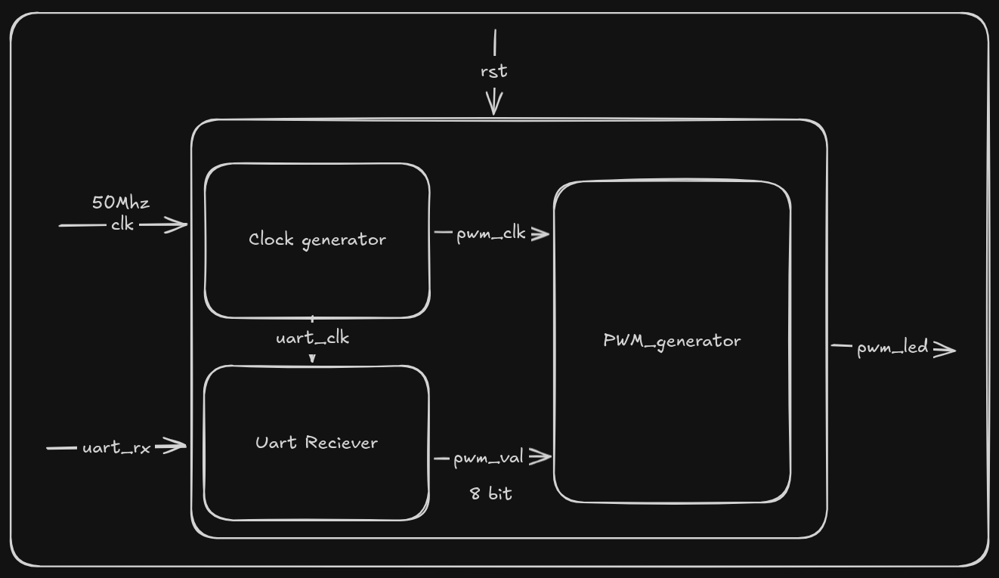

# UART-Controlled PWM (Tang Primer 25K)

A lightweight FPGA design that receives 8-bit data over UART and generates a corresponding PWM output.

---

## Overview

This project implements a UART-to-PWM controlled on the Tang Primer 25K.
An external host (PC or microcontroller) sends a single byte (0–255), which directly controls the PWM duty cycle.

---

## Architecture




---

## Features

* 8-bit PWM resolution (0–255)
* UART-controlled duty cycle
* Fully synchronous design
* Modular RTL structure
* Compatible with standard 9600 baud UART

---

## UART Specification

| Parameter | Value |
| --------- | ----- |
| Baud Rate | 9600  |
| Data Bits | 8     |
| Stop Bits | 1     |
| Parity    | None  |

---

## PWM Behavior

* The PWM module uses an 8-bit counter
* Duty cycle is updated whenever a new byte is received
* Output is continuous and glitch-free between updates

---

## Host Interface

Any UART-capable device can be used:

* PC serial terminal
* Microcontroller (Arduino, etc.)
* USB-to-UART adapter

The host must send **raw byte values**, not ASCII strings.

---

## Example

Sending:

```text
0x00 → LED OFF  
0x80 → ~50% brightness  
0xFF → LED fully ON
```